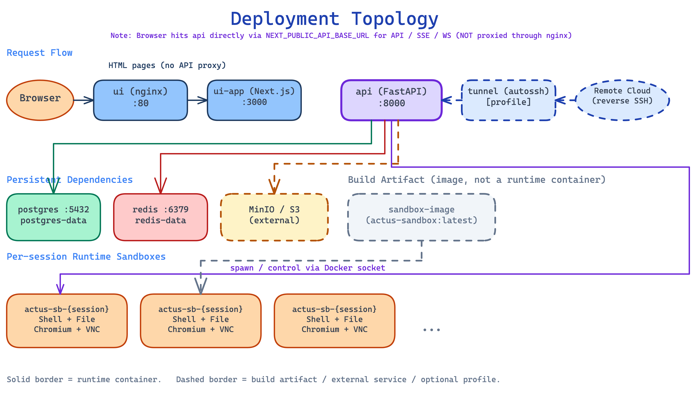

# Deployment Guide

本指南对应当前 `docker-compose.yml` 的实际运行方式，适用于单机部署 Actus。

## 部署拓扑



Compose 会启动或构建以下组件：

- `postgres`：持久化会话、用户、文件元数据
- `redis`：限流、状态、Embedding 缓存与部分运行时协调
- `minio`：仅绑定 loopback 的本地对象存储
- `minio-init`：幂等创建 API 使用的 `a2a-mcp` bucket
- `sandbox-image`：仅用于构建沙箱镜像，不常驻运行
- `api`：FastAPI 后端
- `ui-app`：Next.js 运行时
- `ui`：nginx 网关，对外暴露前端入口
- `tunnel`：（可选，需显式启用 profile）autossh 反向隧道，将 API 暴露到云服务器

## 1. 前置条件

- Docker Engine + Docker Compose v2
- 至少 6 GB Docker 可用内存
- 可访问的 LLM 提供商 API

## 2. 配置环境变量

```bash
git clone https://github.com/hahaliu1029/Actus.git
cd Actus
cp .env.example .env
```

至少需要修改这些值：

- `POSTGRES_PASSWORD`
- `JWT_SECRET_KEY`
- `MINIO_ACCESS_KEY`
- `MINIO_SECRET_KEY`
- `NEXT_PUBLIC_API_BASE_URL`

补充说明：

- `NEXT_PUBLIC_API_BASE_URL` 是**构建时注入**的前端 API 地址，必须是浏览器可访问的 URL
- `SANDBOX_IMAGE` 默认是 `actus-sandbox:latest`
- 如需调整浏览器接管能力，可额外配置 `SANDBOX_CHROME_ARGS`

标准 Docker Compose 是本地开发拓扑：默认启动本地 MinIO，`minio-init` 会在 API
启动前幂等创建 `a2a-mcp`。S3 API 为 `http://127.0.0.1:9000`，管理控制台为
`http://127.0.0.1:9001`，二者仅绑定 loopback，凭据来自 `MINIO_ACCESS_KEY` /
`MINIO_SECRET_KEY`。修改 `MINIO_API_PORT` 后，public endpoint 自动变为
`localhost:<port>`；高级场景可设置 `MINIO_PUBLIC_ENDPOINT` /
`MINIO_PUBLIC_SECURE`。根目录 `.env` 中旧的 `MINIO_ENDPOINT` 不控制标准 Compose；
容器内 API 始终通过 `minio:9000` 访问本地服务。

从远程对象存储切换到本地 MinIO 会得到新的空数据集，不自动迁移；旧附件仍保留在原
远程 S3，需要另行规划数据迁移。Compose 固定的归档 MinIO release 镜像不作为生产基线。
生产部署及远程 URL 消费者应使用部署者维护的远程 S3 或受保护的 TLS endpoint。

## 3. 启动全部服务

```bash
docker compose --env-file .env up -d --build
```

首次启动时，后端会：

- 自动执行 Alembic 迁移
- 初始化 PostgreSQL / Redis / MinIO 客户端；`minio-init` 完成后才启动 API
- 如果 `/app/data/config.yaml` 不存在，则创建默认运行时配置

## 4. 初始化管理员

```bash
docker compose exec api python scripts/create_super_admin.py
```

## 5. 访问入口

- UI：`http://localhost`（默认 `UI_PORT=80`）
- API 文档：`http://localhost:8000/docs`
- OpenAPI JSON：`http://localhost:8000/openapi.json`

容器模式下，前端链路是：

```text
browser -> ui (nginx:80) -> ui-app (Next.js:3000) -> api
```

## 6. 配置运行时参数

Compose 模式下，Actus 的业务运行时配置不读取仓库中的 `api/config.yaml`，而是读取 `api-data` volume 中的：

```text
/app/data/config.yaml
```

推荐做法：

1. 先完成首次启动
2. 登录前端后台
3. 在 `设置` 中配置：
   - 模型提供商
   - MCP 服务器
   - A2A Agent 配置
   - Skill 风险策略
   - Skill 安装与启用

Skill 目录默认保存在：

```text
/app/data/skills
```

## 7. 验证部署

```bash
docker compose ps
docker compose logs --tail=200 api
docker compose logs --tail=200 ui
```

建议至少检查：

- `api` 健康检查通过
- `ui-app` 和 `ui` 健康检查通过
- `http://localhost:8000/docs` 可打开
- 前端登录后可以进入首页和设置页

如需验证对象存储连通性，可以调用：

- `GET /api/status/minio`
- `GET /api/status/minio?smoke=true`

或在容器内运行：

```bash
docker compose exec api python scripts/minio_smoke_test.py
```

## 8. 停止与清理

```bash
docker compose down
```

删除持久化数据卷：

```bash
docker compose down -v
```

默认持久化卷：

- `postgres-data`
- `redis-data`
- `minio-data`
- `api-data`

## 9. 更新沙箱代码后的重建方式

如果你修改了 `sandbox/` 中的代码，不要运行不存在的 `sandbox` 服务。正确流程：

```bash
docker compose --env-file .env build sandbox-image api
docker compose --env-file .env up -d --force-recreate api
```

如需确保新会话不复用旧容器，可清理历史临时沙箱：

```bash
docker ps --format '{{.Names}}' | grep '^actus-sb-' | xargs -r docker rm -f
```

## 10. 可选：启用 SSH 隧道

如需将本地 API 暴露到外部网络（例如手机访问），可启用 tunnel 服务：

```bash
# 生成 SSH 密钥并配置，详见 tunnel/README.md
docker compose --profile tunnel up -d tunnel
```

`tunnel` profile 只转发 API，不转发本地 MinIO。MCP 或其他远程 URL 直接拉取方需要
能够访问单独配置的 remote/public endpoint。

## 11. 常见注意事项

- **⚠️ API 服务必须单实例部署。** Sandbox 生命周期管理依赖进程内锁，多 worker/多实例会导致状态竞争。不要修改 `docker-compose.yml` 中 `api` 的 `deploy.replicas`，不要在 uvicorn 命令中加 `--workers`，不要 `docker compose up --scale api=N`。多实例需求请参考 `CONTRIBUTING.md` 中 "Sandbox Lifecycle 不变式" 章节。
- 前端 API 地址变化后，需要重新构建 `ui-app`
- `api` 通过挂载的 Docker Socket 动态创建会话沙箱
- 沙箱镜像本身不常驻；真正执行任务的是 API 运行时按需创建的临时容器
- 如果 Redis 不可用，限流相关接口会返回 `503`
- 旧版 Skill API 会返回 `410`，请使用 `/api/v2/skills/*`
- 文件理解功能（音频转录、PDF 解析、视频分析）需要在前端设置页的「文件理解」中配置
