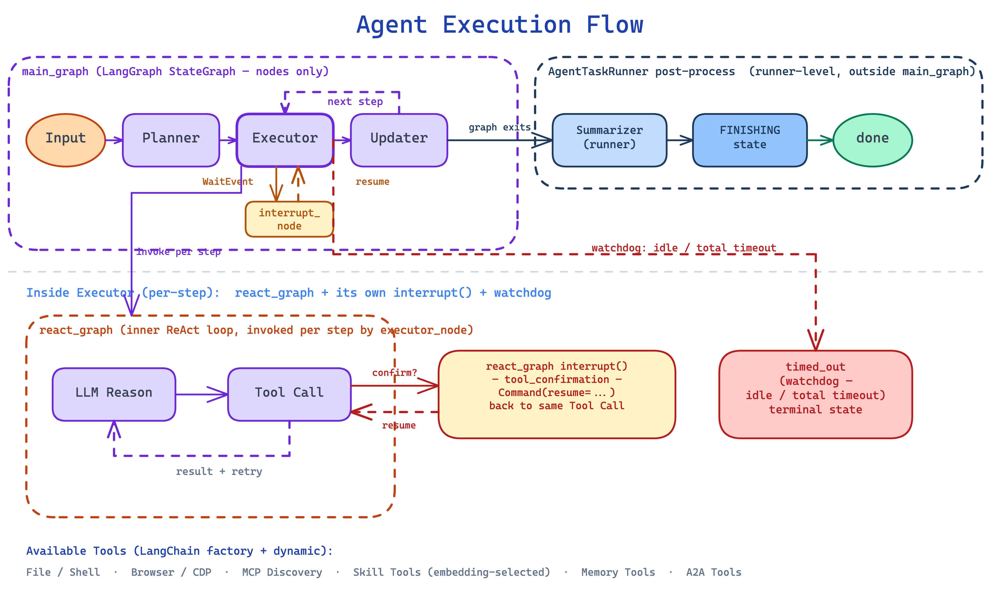
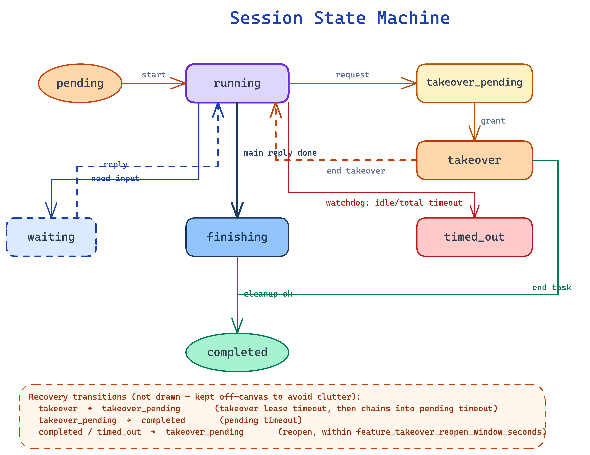

# Actus 项目架构

本文档描述当前代码库的真实分层、运行链路和关键模块，重点对应：

- `api/`
- `ui/`
- `sandbox/`
- `docker-compose.yml`

概览图的文本源与可编辑源分别为 [`architecture.mmd`](architecture.mmd) 和
[`architecture.excalidraw`](architecture.excalidraw)，渲染产物为
[`architecture.svg`](architecture.svg) / [`architecture.png`](architecture.png)。

## 1. 系统组成

Actus 由三个应用运行时和一组 Compose 基础服务构成：

### 1.1 `api/`

FastAPI 后端，负责：

- 用户认证与管理员能力
- 会话创建、消息流、任务状态
- Planner + ReAct Agent 编排
- 工具调用、Skill 运行时选择与扩展准入
- 文件上传下载
- 应用配置、MCP/A2A/Skill/Plugin 管理与扩展治理
- Docker 沙箱生命周期和三档供给模式管理

### 1.2 `ui/`

Next.js 16 前端，负责：

- 登录 / 注册
- 会话列表与首页输入
- 会话详情、任务摘要、文件面板
- 工作台终端 / 浏览器 / VNC / 时间线
- 设置页（LLM、扩展总览、MCP、A2A、Skill、Memory、用户管理）

### 1.3 `sandbox/`

在 `always` / `on_demand` 模式下动态创建的会话级隔离运行环境，提供：

- Shell 执行与 PTY/WebSocket 交互
- 文件读写、替换、搜索
- Chromium + CDP
- Xvfb + x11vnc + websockify
- Supervisor 超时控制与进程管理

`off` 模式不创建该运行时，也不向 Agent 暴露沙箱工具、Skill 创建、接管或 VNC 能力。

### 1.4 Compose 基础服务

标准 `docker-compose.yml` 的服务拓扑为：

- `postgres`：PostgreSQL 17 + pgvector，持久化业务和治理数据
- `redis`：事件恢复、缓存、限流、运行时统计和 coordinator 控制面
- `minio`：默认仅绑定 host loopback 的本地 S3 兼容对象存储
- `minio-init`：等待 MinIO 健康后幂等创建 bucket，成功完成后 API 才启动
- `sandbox-image`：构建并登记动态会话沙箱所用镜像；不是常驻会话沙箱
- `api`：单 worker FastAPI 服务，并通过 Docker socket 管理动态沙箱
- `ui-app` / `ui`：Next.js 应用与对外 Nginx
- `tunnel`：可选 profile，使用 autossh 反向转发 API，不转发 MinIO

`docker-compose.sandbox-off.yml` 会移除 `api` 对 `sandbox-image` 的依赖和 Docker socket，
并停用 `sandbox-image`；该 override 是 `off` 档的规范部署入口。

## 2. 后端分层

后端遵循 `Clean Architecture + DDD` 风格，目录层次如下：

```text
api/
├── core/
├── app/
│   ├── domain/
│   ├── application/
│   ├── infrastructure/
│   └── interfaces/
├── scripts/
└── tests/
```

### 2.1 `core/`

职责：

- 环境变量读取
- JWT 与密码安全
- 全局基础配置

当前关键文件：

- `api/core/config.py`

### 2.2 `domain/`

职责：

- 领域模型：会话、消息、计划、事件、文件、Skill、用户
- 抽象接口：仓储、外部依赖、任务系统
- 领域服务：Agent、Flow、Tool、Prompt

关键结构：

- `app/domain/models/` — 包含 `session`、`message`、`app_config`、`runtime_extension`、`extension_governance`、`plugin_manifest`、`memory_chunk`、`approval_grant`、`user_tool_approval_policy` 等
- `app/domain/repositories/` — 仓库接口（含 `memory_chunk_repository`、`approval_grant_repository`、`user_tool_approval_policy_repository`、`tool_approval_log_repository`）
- `app/domain/external/` — 外部依赖协议（`sandbox` / `browser` accessor、`extension_admission`、`file_processor`、`embedding_provider`、`embedding_cache`、`memory_flusher`、`event_recovery`、`telemetry`）
- `app/domain/services/graphs/` — LangGraph 状态机（main_graph、react_graph、state、event_bridge、compaction、context_assembler、token_estimator、background_summary、step_metadata、message_utils）
- `app/domain/services/flows/` — 流程编排（PlannerReActFlow、skill_creation_graph）
- `app/domain/services/tools/` — LangChain 工具（langchain_tools、langchain_mcp、langchain_a2a、skill、langchain_mcp_discovery、langchain_dynamic_skill_tools、memory_tools、tool_failure_tracker）
- `app/domain/services/prompts/` — 模块化提示词子包（assembler、section、render_context、budget、invariants、errors、sections/、bundles/、reminders/）
- `app/domain/services/permission/` — Permission Engine、native/MCP/A2A/Skill source、child scope、confirmation queue 与 Smart Approve escalation provider
- `app/domain/services/approval_state_reader.py` — grant 单一读路径
- `app/domain/services/execution_watchdog.py`、`execution_metrics.py` — 执行健康监控（D5）
- `app/domain/services/json_envelope.py` — 统一工具调用结果封装
- `app/domain/services/memory_ranker.py` — 记忆混合检索与重排
- `app/domain/services/skill_md_parser.py` — SKILL.md 解析
- `app/domain/services/skill_md_exporter.py` — SKILL.md 导出
- `app/domain/services/extension_admission_gates.py`、`extension_admission_logic.py`、`extension_hashing.py`、`extension_scan.py` — 扩展准入、pin 与静态扫描

### 2.3 `application/`

职责：

- 用例编排
- 业务规则收敛
- 组合仓储、外部依赖与领域服务

当前重点服务：

- `AgentService`
- `SessionService`
- `AuthService`
- `FileService`
- `AppConfigService`
- `SkillService`
- `SkillCreatorService`
- `UserToolPreferenceService`
- `MemoryFlushService` — 后台异步记忆刷新，含指数退避和熔断器
- `SandboxLifecycleService` / `SandboxProvisioner` — 沙箱绑定生命周期和 `on_demand` 单飞供给
- `RuntimeExtensionService` / `ExtensionProbeService` — 扩展聚合、健康与活跃度快照
- `ExtensionInstallService` / `ExtensionGovernanceService` / `ExtensionReconciler` — MCP/A2A 安装预检、准入治理与配置差量同步
- `PluginInstallService` — Plugin bundle 预检与可补偿安装/卸载 saga

### 2.4 `infrastructure/`

职责：

- PostgreSQL / Redis / MinIO 客户端
- SQLAlchemy ORM 模型与仓储实现
- Docker Sandbox、搜索、浏览器、LLM 等外部实现
- 日志初始化

关键目录：

- `app/infrastructure/storage/`
- `app/infrastructure/repositories/` — 包含 `db_memory_chunk_repository`、`db_approval_grant_repository`、`db_user_tool_approval_policy_repository`、`db_tool_approval_log_repository`
- `app/infrastructure/models/` — ORM 模型，包含 `memory_chunk_orm`、`tool_approval_grant`、`user_tool_approval_policy`、`tool_approval_log`
- `app/infrastructure/external/`
  - `llm/` — LLM 适配器 + 消息清洗器（message_sanitizer）+ telemetry mixin + timeout helpers
  - `embedding/` — Embedding 提供者、Redis 缓存、向量索引、熔断器（circuit_breaker_embedding_provider）
  - `file_processors/` — 文件处理器（audio、image、pdf、video、registry）
  - `event_recovery/` — 基于 Redis Stream 的会话事件恢复
  - `sandbox/` — Docker 沙箱客户端
  - `file_storage/` — MinIO/S3 文件存储
- `app/infrastructure/external/governance/` — PostgreSQL 扩展 registry/admission、审计脱敏和 Plugin saga store
- `app/infrastructure/telemetry/` — Prompt 与 LLM 调用的 telemetry 实现
- `app/infrastructure/checkpointer_pool.py` — LangGraph 检查点连接池
- `app/infrastructure/logging/`

### 2.5 `interfaces/`

职责：

- FastAPI 路由
- Pydantic Schema
- 认证与限流依赖
- 异常处理
- 依赖注入组装

关键目录：

- `app/interfaces/endpoints/`
- `app/interfaces/schemas/`
- `app/interfaces/dependencies/`
- `app/interfaces/errors/`
- `app/interfaces/service_dependencies.py`（主要 DI 入口）
- `app/interfaces/repository_dependencies.py`（已废弃）

扩展相关路由集中在：

- `runtime_extension_routes.py` — `/api/v1/runtime/extensions` 清单、启停与手动探测
- `extension_governance_routes.py` — `/api/v2/extensions` 治理摘要、观测、pin、隔离和审计
- `plugin_routes.py` — `/api/v2/plugins` Plugin 预览、安装、启停与卸载

## 3. 依赖方向

```text
Interfaces -> Application -> Domain
                 ^
                 |
          Infrastructure

Core 被多层共享使用
```

说明：

- `Domain` 不直接依赖 FastAPI、SQLAlchemy、Redis 等框架实现
- `Infrastructure` 实现 `Domain` 定义的接口
- `Interfaces` 通过 FastAPI `Depends()` 组装具体服务

## 4. Agent 执行链路

### 4.1 入口

会话聊天请求从 `api/app/interfaces/endpoints/session_routes.py` 的：

- `POST /api/sessions/{session_id}/chat`

进入系统，并以 SSE 持续输出事件。

### 4.2 运行时对象

`AgentService` 负责：

- 校验会话和附件权限
- 按 `SANDBOX_PROVISION_MODE` 组装 eager、lazy 或无沙箱运行面
- 创建 `AgentTaskRunner`
- 启动或恢复任务执行
- 处理停止、接管、续期、补救等控制流

沙箱依赖不再以裸 handle 直接传遍工具层，而是通过 `SandboxAccessor` / `BrowserAccessor`
注入：`always` 使用零 I/O 的 eager wrapper，`on_demand` 使用 `SandboxProvisioner` 驱动的
lazy accessor，`off` 则两者均为 `None`。这使文件、Shell、浏览器、附件同步和 coordinator
父沙箱 I/O 共用同一供给边界。

### 4.3 LangGraph 两层图架构



默认流程通过 `PlannerReActFlow` 驱动，内部使用 LangGraph StateGraph：

**外层 main_graph（`domain/services/graphs/main_graph.py`）：**

1. `planner_node` — LLM 生成任务计划（with_structured_output）
2. `executor_node` — 默认调用 react_graph 执行当前步骤；开关和计划同时满足时可转入 coordinator 并行子图
3. `updater_node` — LLM 评估执行结果，更新计划状态
4. `summarizer_node` — LLM 生成最终总结 + 文件附件

**内层 react_graph（`domain/services/graphs/react_graph.py`）：**

LLM reasoning → tool calls → tool results → 循环直到完成或需要用户输入

**事件桥接（`domain/services/graphs/event_bridge.py`）：**

将 LangGraph `astream_events` 转换为 Actus 的 SSE 事件（MessageEvent、ToolEvent、PlanEvent 等）

**Skill 创建子图（`domain/services/flows/skill_creation_graph.py`）：**

独立状态机：blueprint_node → generate_node → install_node，每步带用户确认门控

### 4.4 事件模型

前端接收的主要 SSE 事件类型：

- `message`
- `title`
- `step`
- `plan`
- `tool`
- `wait`
- `control`
- `done`
- `error`

## 5. 工具体系

工具分为两类：

### 5.1 LangChain 工厂工具（`langchain_tools.py`）

通过工厂函数创建，返回 `list[StructuredTool]`：

- `_make_file_tools(sandbox_accessor)` → file_read, file_write, file_str_replace, file_find_in_content, file_find_by_name, file_list
- `_make_shell_tools(sandbox_accessor)` → shell_execute, shell_read_output, shell_wait_process, shell_write_input, shell_kill_process
- `_make_browser_tools(browser_accessor)` → browser_view, browser_navigate, browser_click, browser_input, etc.

每次工具调用通过 accessor 获取当前 handle：`always` 只是返回已创建实例，`on_demand` 的首次
`get()` 会触发单飞供给。`apply_sandbox_capability_gate()` 在 `off` 模式从最终工具集合移除
文件、Shell、浏览器、`file_view` 和 Skill 创建面，并同步收缩接管提示词 schema。

### 5.2 领域工具（继承 `BaseTool`）

- `skill.py` — SkillTool，native/mcp/a2a skill 运行时调度
- `create_skill.py` — CreateSkillTool，Skill 生成与安装
- `brainstorm_skill.py` — BrainstormSkillTool，Skill 蓝图分析
- `langchain_mcp.py` — MCP 工具适配为 LangChain StructuredTool
- `langchain_mcp_discovery.py` — 渐进式 MCP 工具发现（list_mcp_tools / get_mcp_tool）
- `langchain_a2a.py` — A2A 工具适配为 LangChain StructuredTool
- `langchain_skill_tools.py` — Skill 工具适配为 LangChain StructuredTool
- `langchain_dynamic_skill_tools.py` — 基于 Embedding 向量相似度动态选择 Skill 工具

### 5.3 LLM 适配器（`infrastructure/external/llm/`）

- `ActusChatModel` — 包装 OpenAI Chat Completions API 为 LangChain BaseChatModel
- `ActusResponsesModel` — 包装 OpenAI Responses API
- `ActusFallbackChatModel` — Chat Completions 优先，失败回退 Responses

所有适配器调用前经过 `message_sanitizer.py` 清洗多模态内容（图片 >5MB、无效 MIME、PDF >50MB）。

## 6. Skill 与扩展生态

### 6.1 Skill v2

当前 Skill 体系特点如下：

- 权威存储位于文件系统，而非数据库
- 默认根目录：`/app/data/skills`
- 支持 GitHub 仓库、本地目录和 SKILL.md 格式安装
- 基于 Embedding 向量相似度进行语义 Skill 选择
- 用户层开关保存在 `user_tool_preferences`
- 旧版 `/api/app-config/skills/*` 接口保留为 `410` 迁移提示

关键组件：

- `SkillService`
- `SkillSourceLoader`
- `SkillIndexService`
- `SkillSelector`
- `SkillTool`
- `FileSkillRepository`

### 6.2 统一运行时扩展视图

`RuntimeExtensionService` 聚合 MCP、A2A、Skill 和 Plugin，输出配置启停、健康、活跃度、
统计与（仅管理员可见的）治理投影。GET 聚合只读取配置和进程内/Redis 快照，不在请求路径
发起网络探测；MCP/A2A 的主动探测由 `ExtensionProbeService` 管理，Skill 健康来自文件完整性。

运行时启停仍由各自权威写路径负责：MCP/A2A 写 `AppConfigService`，Skill 写
`SkillService`；治理隔离与启停通过 registry 的 CAS revision 单独控制，避免配置写与治理写
互相覆盖。

### 6.3 扩展治理与 Plugin

`EXTENSION_GOVERNANCE_MODE` 是 env-only 三态开关：

- `off`：不构造 registry/admission/Plugin 服务，既有 MCP/A2A/Skill 路径保持原行为
- `shadow`：检测类原因 fail-open，仍记录观测、pin、扫描和审计；行政/结构类阻断继续生效
- `enforce`：未 pin、pin 失配或 registry 故障时 fail-closed

准入 gate 位于工具真正装配/调用的咽喉：MCP 校验配置指纹和工具 surface，A2A 校验配置指纹
和 Agent Card，Skill 校验 artifact hash；被隔离或停用的扩展不会进入最终工具集合。

Plugin 是不可直接执行的元容器。`plugin.json` 可声明 Skill、MCP、A2A 成员；
`PluginInstallService` 先对不可变 bundle 快照执行 containment、secret、scan、probe、expected hash
和身份碰撞预检，再通过数据库 operation steps + 文件 staging 完成可补偿安装。启动时会收敛未完成
saga，父 Plugin 的阻断状态会投影到成员准入。

## 7. 会话与接管



当前会话状态枚举位于 `api/app/domain/models/session.py`：

- `pending`
- `running`
- `takeover_pending`
- `takeover`
- `waiting`
- `finishing` — 异步收尾（最终摘要、附件归档、未读计数刷新、lifespan 清理）
- `completed`
- `timed_out` — watchdog 总超时或恢复失败时强制终止

接管能力包括：

- 主动发起 `shell` / `browser` 接管
- 接管租约续期
- 结束接管后继续执行或直接完成
- 在窗口期内对已完成会话执行补救重开

相关 API 与 WebSocket 位于：

- `session_routes.py`

## 8. 前端结构

前端使用 App Router，主要页面如下：

- `/`：首页输入与会话入口
- `/login`
- `/register`
- `/sessions/[id]`：会话详情与工作台

关键组件：

- `LeftPanel`：会话列表与主题切换
- `ChatInput`：输入区
- `SessionTaskDock`：任务摘要与文件面板
- `WorkbenchPanel`：终端 / 浏览器 / VNC / 时间线
- `components/manus-settings.tsx`：设置总入口
- `settings/extensions-overview.tsx`：MCP/A2A/Skill/Plugin 运行时状态与管理员治理面
- `settings/plugin-install-dialog.tsx`：Plugin dry-run、确认与安装结果

状态管理：

- `ui/src/lib/store/` 下使用 Zustand

## 9. 沙箱结构

### 9.1 容器运行时

沙箱镜像由 `sandbox/Dockerfile` 构建，容器内通过 `supervisord.conf` 启动：

- FastAPI 应用（8080）
- Chromium（经 `socat` 转发到 9222）
- Xvfb
- x11vnc（5900）
- websockify（5901）

沙箱 API 路由分为：

- `/api/file/*`
- `/api/shell/*`
- `/api/supervisor/*`

API 服务不会常驻调用独立的 Compose `sandbox` 容器，而是基于镜像动态创建临时会话容器。

### 9.2 生命周期与供给控制面

- `SandboxLifecycleService` 维护 `UNBOUND → CREATING → ACTIVE → SUSPENDED / DESTROYING → DESTROYED` 绑定状态和持久化审计
- `ProvisionFlightTable` 对同一 session 的并发创建做单飞，并在销毁/删除时使进行中的 flight 失效
- `SandboxProvisioner` 是每次 run 的 `on_demand` 状态机：`unprovisioned → provisioning → hooks → ready`；附件和 Skill 同步作为幂等 post-provision hooks
- `EagerSandboxAccessor` / `EagerBrowserAccessor` 保持 `always` 的启动时供给语义
- `OnDemandSandboxAccessor` / `OnDemandBrowserAccessor` 将首次真实访问变成供给触发点；`peek()` 只观察，不创建容器，后台 enrichment 也不得触发供给
- `off` 不构造 accessor/provisioner，启动时拒绝与三个 coordinator flag 同时开启，并由 Compose override 移除 Docker socket

`on_demand` 的 create/ready/hooks 共用 `SANDBOX_PROVISION_TIMEOUT_SECONDS` 总预算；等待者取消、
session suspend/finalize、供给失效和普通失败使用不同错误语义，避免隐式恢复已暂停/终止会话。

## 10. 配置来源

### 10.1 Compose 环境变量

由根目录 `.env` 驱动，主要用于：

- 数据库密码
- JWT 密钥
- MinIO/S3 接入：标准 Compose 内部固定为 `minio:9000`，浏览器 URL 由 `MINIO_PUBLIC_ENDPOINT` / `MINIO_PUBLIC_SECURE` 单独决定
- UI 对外地址
- 沙箱镜像与网络
- `SANDBOX_PROVISION_MODE` / `SANDBOX_PROVISION_TIMEOUT_SECONDS`（env-only）
- `EXTENSION_GOVERNANCE_MODE`（env-only）

标准 Compose 的 `minio-init` 使用 `mc mb --ignore-existing` 幂等创建
`MINIO_BUCKET_NAME`，API 依赖其 `service_completed_successfully`。`MINIO_SITE_REGION` 写入 MinIO
服务端；`minio-data` volume 持久化对象。生产或远程 URL 消费场景应改用部署者管理的 S3/TLS
端点，现有 `tunnel` profile 不转发 MinIO。

### 10.2 后端运行时配置

由 `AppConfig` 管理，包括：

- LLM 配置
- Agent 配置
- MCP 配置
- A2A 配置
- Skill 风险策略

容器模式下默认文件路径：

```text
/app/data/config.yaml
```

本地开发默认文件路径：

```text
api/config.yaml
```

## 11. 测试布局

后端测试位于：

- `api/tests/app/`
- `api/tests/domain/`
- `api/tests/integration/`
- `api/tests/structure/`
- `api/tests/sandbox/`

前端测试与源码并列，主要位于：

- `ui/src/**/*.test.ts`
- `ui/src/**/*.test.tsx`

## 12. 当前设计要点

- **LangGraph 状态机**：Agent 编排从自定义 BaseAgent 迁移到 LangGraph StateGraph，获得原生的状态持久化、中断恢复、事件流能力
- **LangChain 统一接口**：LLM 调用通过 BaseChatModel 抽象，工具通过 `@tool` 装饰器注册，支持 `with_structured_output` 和 `bind_tools`
- **上下文溢出治理**：TokenEstimator（混合 token 估算）+ ContextAssembler（同步三阶段裁剪）+ GradualCompactor（异步两级压缩：85% LLM 摘要 / 95% 硬截断）
- **模块化提示词系统（B5）**：sections / bundles / reminders / assembler / budget 子模块组合；`updater_node` 是 **唯一** 允许写 `state.skill_context` 的节点，CI gate 通过 AST 扫描禁止 executor 写回
- **多模态文件理解**：FileProcessorRegistry 按 MIME 路由到 audio/image/pdf/video 处理器，支持双引擎转录和双路径 PDF 解析
- **Embedding Skill 选择**：基于 OpenAI Embedding + numpy 向量索引 + Redis 缓存的语义 Skill 匹配，配合熔断器避免级联失败
- **Agent 记忆系统**：`memory_search` / `memory_get` 工具 + 检索流水线（cosine 相似度 → 时间衰减 → MMR 多样性重排），记忆数据走独立的 `memory_chunks` 表 + alembic 迁移
- **Permission Engine 工具审批**：native/MCP/A2A/Skill 共用 `DefaultPermissionEngine`；用户工具偏好为 `auto` / `ask` / `deny`，ApprovalState Reader/Writer 管理 session/always grant，ConfirmationQueue 承载暂停与恢复，Smart Approve 作为可降级 escalation provider，并保留持久化审计
- **会话事件恢复**：Redis Stream 持久化 SSE 事件，刷新或断线重连后从最后位点继续，避免中途状态丢失
- **执行健康监控（D5）**：步骤级超时 watchdog + 执行指标 + 工具失败追踪 + 统一 JSON Envelope；LLM 调用预算与 LangGraph RetryPolicy 对齐，避免 9× HTTP 重试放大
- **渐进式 MCP 发现**：先列出 metadata，按需加载完整 schema 并激活
- **统一扩展治理**：MCP/A2A/Skill/Plugin 共用 registry、来源与内容 pin、扫描、隔离和审计；`shadow` 对检测异常 fail-open，`enforce` fail-closed，`off` 不改变既有路径
- **Plugin saga**：Plugin 以不可变 bundle 快照完成 dry-run/preflight，真实安装采用 staging + operation steps + 补偿与启动恢复，成员仍回到各自 Skill/MCP/A2A 权威存储
- **Checkpointer 连接池**：psycopg AsyncConnectionPool，应用生命周期管理
- **三阶段 Skill 生成**：manifest → 逐个脚本 → SKILL.md，每阶段独立重试，失败修复支持定向重生成
- **FINISHING 中间态**：`RUNNING → FINISHING → COMPLETED`，承载最终摘要、附件归档、未读计数刷新、lifespan 清理等异步收尾动作，pod 重启时可幂等恢复
- **多语言贯通**：`Message.language` 字段从入口贯穿到 prompt assembler，按用户语言派发中英文 bundle
- **三档沙箱供给**：`always` 保持 eager 行为，`on_demand` 通过 accessor + per-run provisioner 延迟创建，`off` 同时收缩工具、提示词、端点和 Compose 权限面
- **MinIO 内外端点分离**：容器内对象 I/O 走 `minio:9000`，预签名 URL 使用 public endpoint；本地 bucket 由 `minio-init` 幂等初始化
- **Telemetry 钩子**：LLM 调用与 prompt 组装的关键指标统一埋点
- 前端与后端都采用流式交互，减少长任务等待感
- Skill、MCP、A2A 都纳入同一套 Agent 工具调度体系
- 接管不是单点功能，而是贯穿状态机、SSE 事件、WebSocket 与前端工作台的完整链路
- Shell/Skill 执行产生的输出文件自动同步到会话文件列表
- Compose 部署与本地开发的配置来源不同，文档和运维需要明确区分
